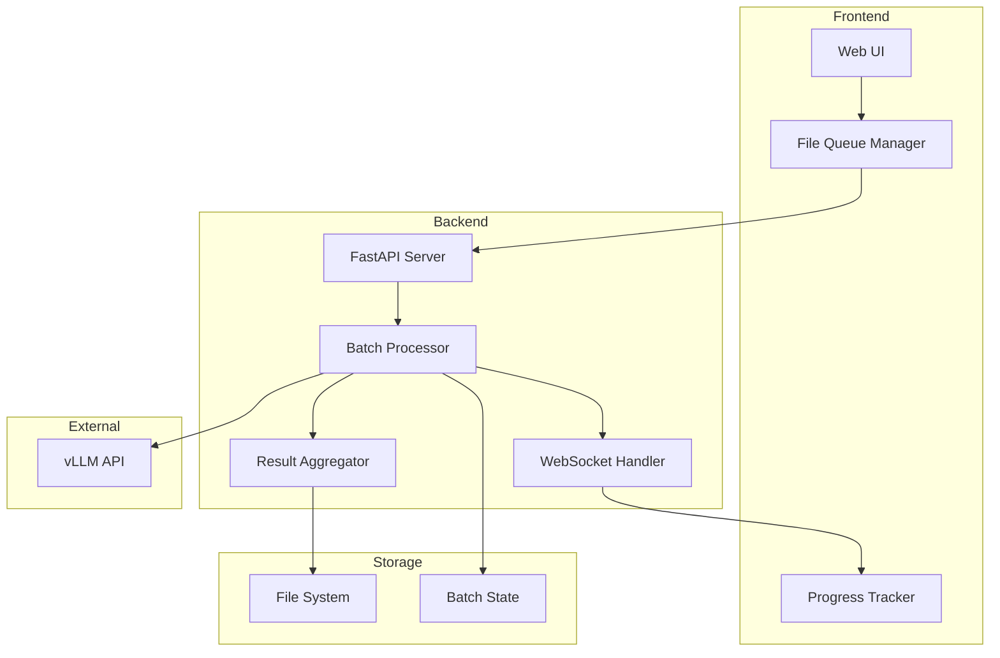
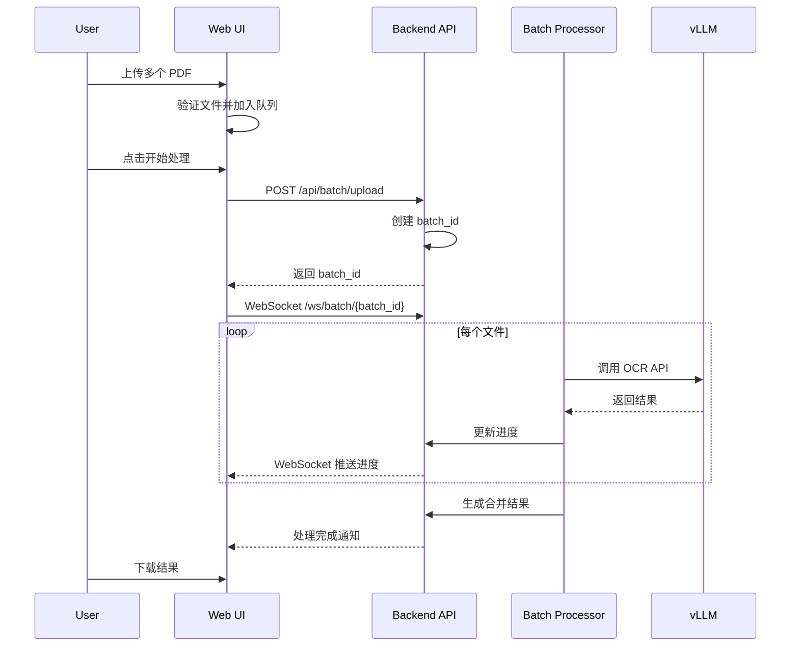

# Design Document: Batch PDF Processing

## Overview

本设计为 DeepSeek-OCR Web UI 添加批量 PDF 处理功能。系统采用前后端分离架构，前端负责文件队列管理和进度展示，后端负责顺序处理 PDF 文件并通过 WebSocket 推送进度。

## Architecture



### 处理流程



## Components and Interfaces

### 1. 前端组件

#### BatchUploadArea
负责多文件上传和队列展示。

```typescript
interface FileItem {
    id: string;           // 唯一标识
    file: File;           // 文件对象
    name: string;         // 文件名
    size: number;         // 文件大小 (bytes)
    status: 'pending' | 'uploading' | 'processing' | 'completed' | 'error';
    progress: number;     // 0-100
    error?: string;       // 错误信息
    result?: string;      // OCR 结果
    pageCount?: number;   // PDF 页数
}

interface BatchState {
    batchId: string | null;
    files: FileItem[];
    overallProgress: number;
    status: 'idle' | 'uploading' | 'processing' | 'completed' | 'error';
}
```

#### BatchProgressPanel
显示批量处理进度。

```typescript
interface BatchProgressProps {
    files: FileItem[];
    overallProgress: number;
    onFileClick: (fileId: string) => void;
    onFileRemove: (fileId: string) => void;
}
```

### 2. 后端 API

#### POST /api/batch/upload
上传批量文件并创建批次任务。

```python
# Request: multipart/form-data
# - files: List[UploadFile]
# - prompt: str (OCR 提示词)

# Response
{
    "status": "success",
    "batch_id": "abc12345",
    "files": [
        {"file_id": "f1", "filename": "doc1.pdf", "size": 1024000},
        {"file_id": "f2", "filename": "doc2.pdf", "size": 2048000}
    ],
    "total_files": 2,
    "total_size": 3072000
}
```

#### POST /api/batch/{batch_id}/start
开始处理批次任务。

```python
# Response
{
    "status": "running",
    "batch_id": "abc12345"
}
```

#### GET /api/batch/{batch_id}/status
获取批次状态。

```python
# Response
{
    "batch_id": "abc12345",
    "status": "processing",  # idle, processing, completed, error
    "overall_progress": 45,
    "files": [
        {"file_id": "f1", "status": "completed", "progress": 100},
        {"file_id": "f2", "status": "processing", "progress": 60}
    ]
}
```

#### GET /api/batch/{batch_id}/result/{file_id}
获取单个文件的 OCR 结果。

```python
# Response
{
    "status": "success",
    "file_id": "f1",
    "filename": "doc1.pdf",
    "content": "OCR 识别结果...",
    "page_count": 5
}
```

#### GET /api/batch/{batch_id}/download
下载所有结果的 ZIP 文件。

```python
# Response: application/zip
# 包含:
# - combined_result.md (合并的 Markdown)
# - individual/doc1.md
# - individual/doc2.md
```

#### DELETE /api/batch/{batch_id}/file/{file_id}
从队列中移除文件（仅限 pending 状态）。

#### WebSocket /ws/batch/{batch_id}
实时进度推送。

```python
# 推送消息格式
{
    "type": "progress",  # progress, file_complete, batch_complete, error
    "batch_id": "abc12345",
    "file_id": "f1",     # 当前处理的文件
    "file_progress": 60, # 当前文件进度
    "overall_progress": 45,
    "status": "processing"
}
```

## Data Models

### BatchTask (后端状态)

```python
@dataclass
class BatchTask:
    batch_id: str
    created_at: datetime
    status: str  # idle, processing, completed, error
    prompt: str
    files: List[BatchFile]
    current_file_index: int
    output_dir: Path

@dataclass
class BatchFile:
    file_id: str
    filename: str
    original_path: Path
    size: int
    status: str  # pending, processing, completed, error
    progress: int
    page_count: Optional[int]
    result_path: Optional[Path]
    error: Optional[str]
```

### 文件存储结构

```
results/
└── batch_{batch_id}/
    ├── state.json           # 批次状态
    ├── uploads/             # 上传的原始文件
    │   ├── f1_doc1.pdf
    │   └── f2_doc2.pdf
    ├── images/              # PDF 转换的图片
    │   ├── f1/
    │   │   ├── page_0.png
    │   │   └── page_1.png
    │   └── f2/
    ├── individual/          # 单个文件结果
    │   ├── doc1.md
    │   └── doc2.md
    └── combined_result.md   # 合并结果
```


## Correctness Properties

*A property is a characteristic or behavior that should hold true across all valid executions of a system—essentially, a formal statement about what the system should do. Properties serve as the bridge between human-readable specifications and machine-verifiable correctness guarantees.*

### Property 1: File Queue Integrity

*For any* set of files added to the queue, the queue state SHALL contain exactly those files with correct names, sizes, and initial "pending" status. Removing a file SHALL decrease the queue length by exactly one.

**Validates: Requirements 1.1, 1.3, 1.4**

### Property 2: File Validation Correctness

*For any* file with a non-PDF extension, the validation function SHALL reject it. *For any* batch exceeding 20 files or 500MB total size, the validation function SHALL reject the excess.

**Validates: Requirements 1.5, 1.6, 1.7**

### Property 3: Status Transition Consistency

*For any* file in the batch, status transitions SHALL follow the valid state machine: pending → processing → completed OR pending → processing → error. No other transitions are valid.

**Validates: Requirements 2.2, 2.3, 2.4**

### Property 4: Overall Progress Calculation

*For any* batch with N total files and M completed files, the overall progress SHALL equal (M / N) * 100, rounded to the nearest integer.

**Validates: Requirements 2.5**

### Property 5: Batch ID Uniqueness

*For any* two batch upload requests, the generated batch_ids SHALL be different.

**Validates: Requirements 3.1**

### Property 6: Sequential Processing Invariant

*For any* batch being processed, at most one file SHALL have status "processing" at any given time. Files SHALL be processed in queue order.

**Validates: Requirements 2.6, 3.2**

### Property 7: Result File Completeness

*For any* completed batch, each completed file SHALL have a corresponding result file on disk. The combined result file SHALL contain all individual results separated by document markers.

**Validates: Requirements 3.4, 3.5, 4.5**

### Property 8: State Persistence Round-Trip

*For any* batch state saved to disk, loading that state SHALL produce an equivalent BatchTask object. After server restart, the batch SHALL resume from the correct file index.

**Validates: Requirements 5.1, 5.2, 5.3**

## Error Handling

### 前端错误处理

| 错误场景 | 处理方式 |
|---------|---------|
| 文件格式不支持 | 显示错误提示，不添加到队列 |
| 超过文件数量限制 | 显示警告，只添加前 20 个文件 |
| 超过总大小限制 | 显示警告，提示移除部分文件 |
| WebSocket 断开 | 自动重连，同时使用轮询备份 |
| 网络请求失败 | 显示错误，允许重试 |

### 后端错误处理

| 错误场景 | 处理方式 |
|---------|---------|
| PDF 解析失败 | 标记文件为 error，继续处理下一个 |
| vLLM API 超时 | 重试 3 次，失败后标记为 error |
| 磁盘空间不足 | 返回错误，停止批次处理 |
| 状态文件损坏 | 尝试从备份恢复，否则重新开始 |

## Testing Strategy

### 单元测试

使用 pytest 进行后端单元测试，使用 Jest 进行前端单元测试。

**后端测试重点：**
- 文件验证逻辑
- 批次状态管理
- 进度计算
- 结果聚合

**前端测试重点：**
- 队列状态管理
- 文件验证
- 进度显示逻辑

### 属性测试

使用 Hypothesis (Python) 进行属性测试，每个属性测试运行至少 100 次迭代。

**测试框架配置：**
```python
from hypothesis import given, strategies as st, settings

@settings(max_examples=100)
@given(...)
def test_property_name():
    ...
```

**属性测试标注格式：**
```python
# Feature: batch-pdf-processing, Property 1: File Queue Integrity
# Validates: Requirements 1.1, 1.3, 1.4
```

### 集成测试

- 完整的批量上传和处理流程
- WebSocket 进度推送
- 结果下载功能
- 状态恢复功能
